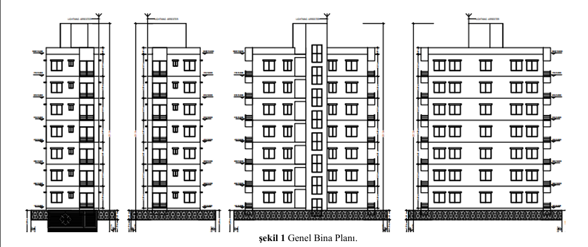
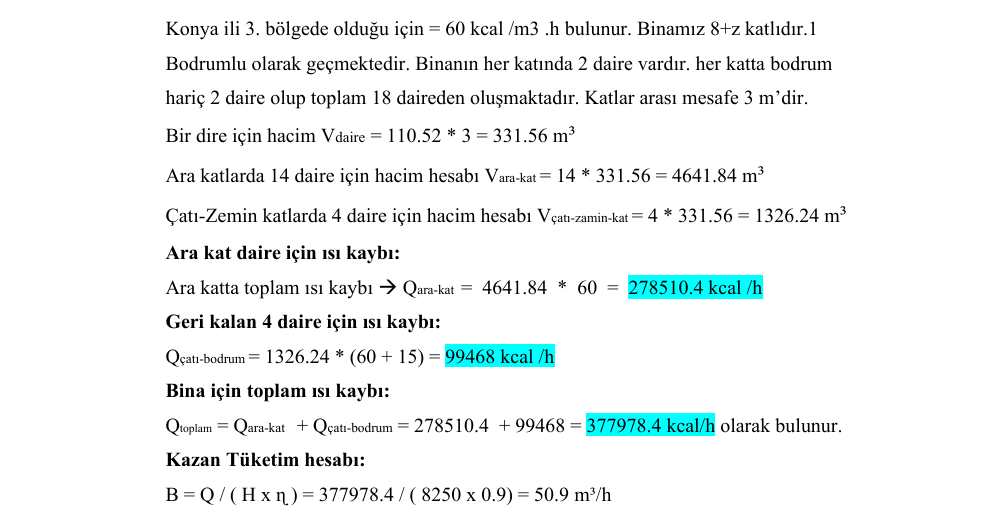
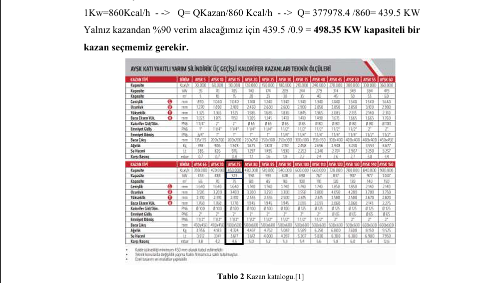
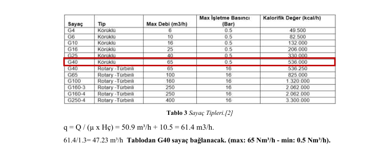
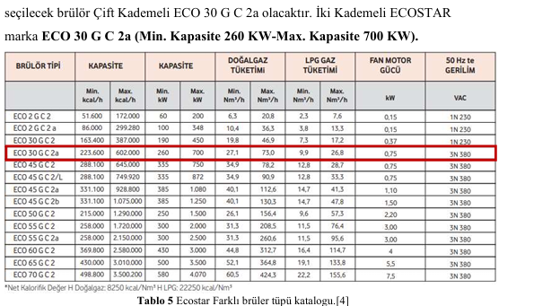
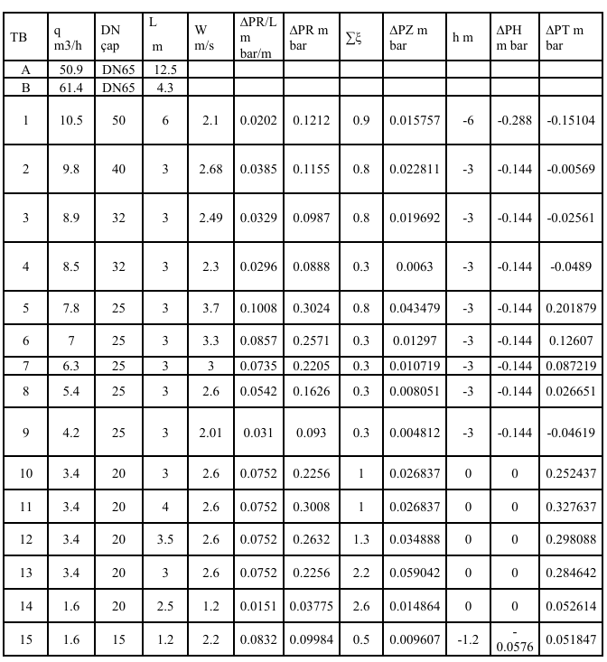
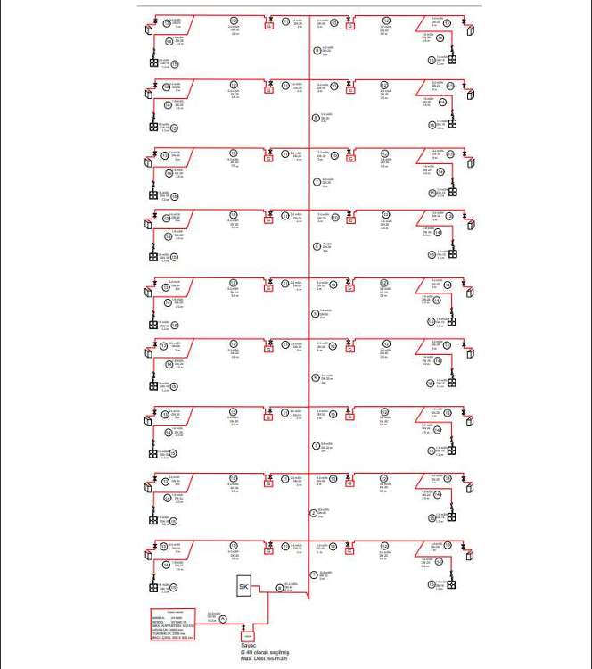
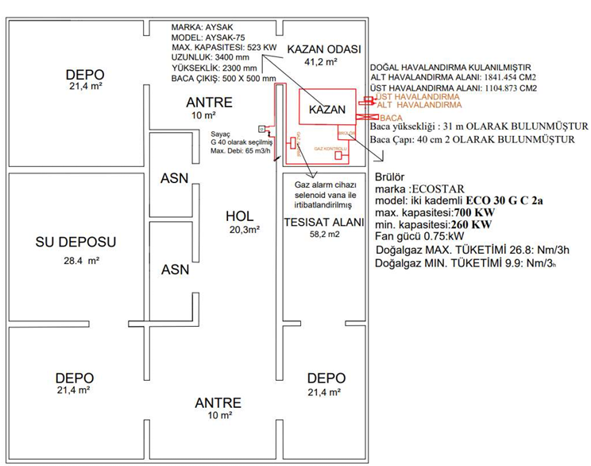
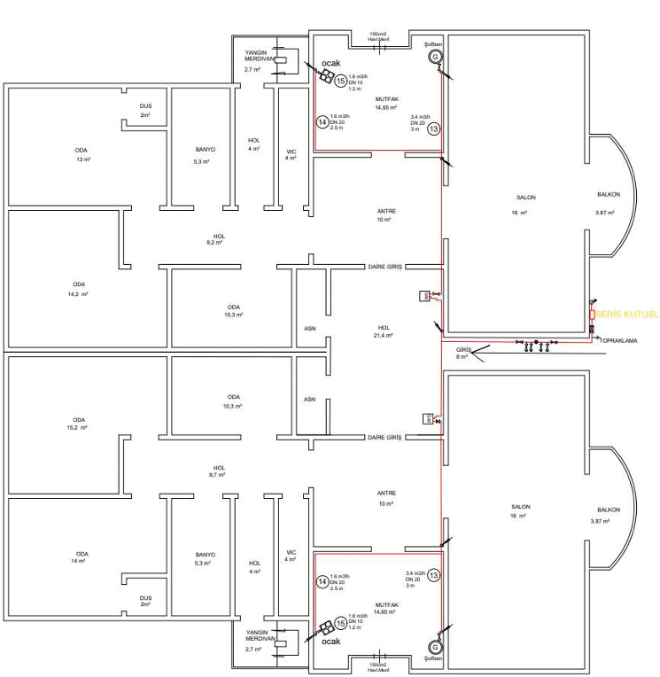
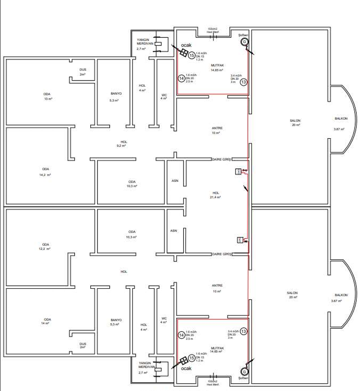

# Natural Gas System Design & Engineering

## Overview
This project presents the design and engineering of a natural gas distribution system for a 10-story residential building. The system was designed to ensure safe, efficient, and standard-compliant natural gas delivery for residential usage and central heating equipment.

The project includes building analysis, heat loss calculation, boiler selection, gas meter selection, burner selection, ventilation calculation, chimney sizing, pressure drop analysis, schematic piping design, and floor plan layout preparation.

## Project Information
- **Project Type:** Mechanical Engineering / MEP / Building Services
- **Building Type:** Residential Building
- **Number of Floors:** 10 floors including basement
- **Number of Apartments:** 18 apartments
- **Location Basis:** Konya, Turkey
- **Software Used:** AutoCAD
- **Main Focus:** Natural gas distribution, heating system design, pipe sizing, and pressure drop calculation

## Project Objectives
- Design a safe and efficient natural gas distribution system for a multi-story residential building.
- Calculate the building heat loss and determine the required boiler capacity.
- Select suitable boiler, gas meter, and burner equipment.
- Calculate ventilation requirements for the boiler room.
- Determine chimney height and chimney diameter.
- Perform pressure drop analysis and pipe diameter selection.
- Prepare schematic gas piping drawings and floor layout plans.

## Engineering Scope
- Building area and volume analysis
- Heat loss calculation
- Boiler capacity calculation
- Boiler selection
- Gas meter selection
- Burner selection
- Dead volume calculation
- Natural ventilation calculation
- Chimney sizing
- Pressure drop calculation
- Natural gas pipe sizing
- Schematic piping diagram preparation
- Basement, ground floor, and typical floor layout design

## Design Process

### 1. Building Analysis
The project started with analyzing the building layout and floor areas. The residential building consists of 10 floors including the basement, with 18 apartments in total.

### 2. Heat Loss Calculation
The heat loss calculation was performed based on the building volume and the regional heat loss coefficient.

**Total heat loss = 377,978.4 kcal/h**

### 3. Boiler Selection
The required boiler capacity was calculated as approximately:

**Boiler capacity = 498.35 kW**

Based on the catalog selection, an **AYSK-75** boiler was selected for the system.

### 4. Gas Meter Selection
The required gas flow rate was calculated as:

**Total flow rate = 61.4 m³/h**

According to the meter selection table, a **G40 gas meter** was selected with a maximum flow capacity of **65 Nm³/h**.

### 5. Burner Selection
A two-stage burner was selected for the system:

**Selected burner:** ECOSTAR ECO 30 G C 2a  
**Minimum capacity:** 260 kW  
**Maximum capacity:** 700 kW  

### 6. Ventilation and Chimney Calculation
The boiler room ventilation areas were calculated as:

- **Lower ventilation area:** 1841.454 cm²
- **Upper ventilation area:** 1104.873 cm²

The chimney height was calculated as:

**Chimney height = 31 m**

### 7. Pressure Drop and Pipe Sizing
Pressure drop calculations were performed for the gas piping system. Different pipe diameters were selected according to gas flow rate, pipe length, velocity, and pressure loss.

### 8. Schematic Diagram
A schematic natural gas piping diagram was prepared to show the gas distribution network across the building.

### 9. Floor Plans

#### Basement Layout

#### Ground Floor Layout

#### Typical Floor Layout

## Key Results
- Designed a natural gas distribution system for a 10-story residential building.
- Calculated total building heat loss as **377,978.4 kcal/h**.
- Selected a boiler capacity of approximately **498.35 kW**.
- Selected **AYSK-75** boiler.
- Selected **G40 gas meter** based on a total flow rate of **61.4 m³/h**.
- Selected **ECOSTAR ECO 30 G C 2a** two-stage burner.
- Calculated boiler room ventilation requirements.
- Performed pressure drop and pipe sizing calculations.
- Prepared schematic piping and floor layout drawings using AutoCAD.

## Tools & Software
- AutoCAD
- Engineering calculation methods
- Pipe sizing analysis
- Pressure drop calculation
- Heat loss calculation
- Technical drawing preparation

## Skills Applied
- Mechanical Engineering
- MEP Design
- Natural Gas System Design
- Pipe Sizing
- Pressure Drop Analysis
- Heat Loss Calculation
- Boiler Selection
- Burner Selection
- Gas Meter Selection
- AutoCAD Drafting
- Technical Documentation
- Building Services Engineering

## Project Files
The full project report is available in the `report/` folder:

[View Project Report](report/Natural-Gas-System-Design.pdf)

## Author
Mohamed Osman  
Mechanical Engineering
